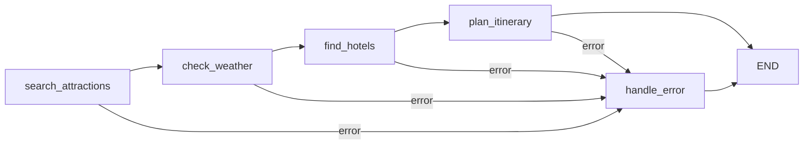

# LangGraph Trip Planner

一个基于 **LangGraph + FastAPI + Vue 3** 的多智能体旅行规划系统。项目将 **POI 搜索、天气查询、酒店推荐、行程生成** 串联为可控的工作流，并接入 **高德地图 MCP 工具链**，为前端结果页提供更适合地图展示的景点、酒店与行程数据。

相比把全部工作都交给单次 LLM 调用，这个项目更偏向“**代码负责确定性检索与数据组织，Agent 负责筛选、理解与规划**”的混合架构：先用工具获取候选 POI / 天气 / 酒店，再由 Agent 进行结构化筛选与行程编排，最后输出适合前端展示的旅行计划。

## ✨ 项目亮点

- **LangGraph 工作流编排**：后端以 `StateGraph` 构建旅行规划链路，核心节点包括 `search_attractions`、`check_weather`、`find_hotels`、`plan_itinerary`，并带有统一错误分流节点 `handle_error`
- **多智能体协作**：景点、天气、酒店与行程规划分别由不同 Agent / 节点处理，职责清晰，便于调试与扩展
- **混合式规划架构**：检索与数据预处理由代码完成，筛选、总结、路线组织由 Agent 完成，兼顾稳定性与生成质量
- **结构化输出优先**：工作流优先读取 `structured_response`，失败时再回退到文本解析，提高可控性与容错性
- **高德地图能力接入**：支持地图搜索、地理编码、天气与路线相关能力，便于前端做坐标标注和地图可视化
- **前后端分离**：后端提供旅行规划与地图相关接口，前端使用 Vue 3 + TypeScript 构建表单页与结果页
- **面向展示的结果组织**：结果页不仅展示每日行程，也适合配合地图标记、路线连接、天气信息等内容统一呈现

## 🏗️ 系统架构

### 1. 工作流设计

项目的核心是一个基于 LangGraph 的顺序式旅行规划工作流：



### 2. 各节点职责

| 节点                 | 作用         | 说明                                                         |
| -------------------- | ------------ | ------------------------------------------------------------ |
| `search_attractions` | 搜索候选景点 | 根据城市与偏好构造查询，由 Agent 返回结构化景点列表或可解析文本 |
| `check_weather`      | 查询天气     | 获取城市天气信息，为后续行程规划提供上下文                   |
| `find_hotels`        | 搜索酒店     | 根据住宿偏好生成候选酒店列表                                 |
| `plan_itinerary`     | 生成完整行程 | 综合景点、天气、酒店信息输出最终行程 JSON                    |
| `handle_error`       | 错误兜底     | 任一节点失败后统一收口，避免整条流程直接崩溃                 |

### 3. 运行逻辑

整体流程并不是“让 LLM 从零生成旅行计划”，而是：

1. 根据用户输入构造景点搜索条件
2. 使用 Agent / 工具获得候选景点数据
3. 查询目标城市天气
4. 结合住宿偏好搜索酒店
5. 将景点、天气、酒店整合后交给 Planner Agent 生成日程安排
6. 输出适合前端渲染的结构化结果

这种设计的优势在于：

- **可解释**：每一步都能单独查看输入与输出
- **可维护**：节点之间解耦，便于替换模型或工具
- **可容错**：支持结构化输出失败后的文本解析回退
- **更适合地图场景**：比纯对话式旅行规划更适合坐标、地点、路线的前端展示

## 🧰 技术栈

| 层级       | 技术                      |
| ---------- | ------------------------- |
| 工作流编排 | LangGraph (`StateGraph`)  |
| Agent 框架 | LangChain                 |
| 后端服务   | FastAPI                   |
| 模型接入   | OpenAI 兼容 API           |
| 地图能力   | 高德地图 MCP / 地图服务   |
| 前端框架   | Vue 3 + TypeScript + Vite |
| UI         | Ant Design Vue            |
| 地图展示   | 高德地图 JavaScript API   |

## 📁 项目结构

```text
LangGraph-Trip-Planner/
├── backend/
│   ├── app/
│   │   ├── workflows/
│   │   │   ├── trip_planner_graph.py
│   │   │   └── trip_planner_state.py
│   │   ├── agents/
│   │   │   └── agents.py
│   │   ├── api/
│   │   │   ├── main.py
│   │   │   └── routes/
│   │   │       ├── trip.py
│   │   │       ├── poi.py
│   │   │       └── map.py
│   │   ├── services/
│   │   │   ├── llm_service.py
│   │   │   ├── amap_service.py
│   │   │   └── unsplash_service.py
│   │   ├── models/
│   │   │   └── schemas.py
│   │   ├── tools/
│   │   │   └── amap_mcp_tools.py
│   │   └── config.py
│   └── run.py
├── frontend/
│   ├── src/
│   │   ├── views/
│   │   │   ├── Home.vue
│   │   │   └── Result.vue
│   │   ├── services/
│   │   │   └── api.ts
│   │   ├── types/
│   │   │   └── index.ts
│   │   ├── App.vue
│   │   └── main.ts
│   └── vite.config.ts
└── README.md
```

## 🚀 快速开始

### 环境要求

- Python 3.10+
- Node.js 16+
- npm 或 yarn
- 高德地图 API Key
- 兼容 OpenAI API 的模型服务 Key

### 1. 启动后端

```bash
cd backend

python -m venv venv

# Windows
venv\Scripts\activate

# macOS / Linux
source venv/bin/activate

pip install fastapi uvicorn langchain langchain-openai langgraph langchain-mcp-adapters pydantic pydantic-settings python-dotenv httpx
```

创建 `.env` 文件：

```dotenv
# 高德地图
AMAP_API_KEY=你的高德 Web 服务 Key

# LLM 配置
LLM_API_KEY=你的模型 API Key
LLM_BASE_URL=https://api.siliconflow.cn/v1
LLM_MODEL_ID=deepseek-ai/DeepSeek-V3.2

# 可选：图片服务
UNSPLASH_ACCESS_KEY=
UNSPLASH_SECRET_KEY=

# Agent 参数（可选）
AGENT_MAX_ITERATIONS=5
AGENT_TEMPERATURE=0.7
AGENT_TIMEOUT=300.0
```

启动后端：

```bash
uvicorn app.api.main:app --reload --host 0.0.0.0 --port 8000
```

### 2. 启动前端

```bash
cd frontend
npm install
npm run dev
```

如果结果页使用高德地图 JS API，请在前端对应配置中填入地图 Key。

### 3. 访问项目

- 前端开发地址：`http://localhost:5173`
- 后端文档地址：`http://localhost:8000/docs`

## 📝 使用流程

1. 输入目标城市与旅行日期
2. 选择出行偏好、住宿偏好与其他个性化要求
3. 提交请求，触发 LangGraph 工作流
4. 系统依次完成景点搜索、天气查询、酒店推荐与行程生成
5. 在结果页查看：
   - 每日行程安排
   - 景点与酒店信息
   - 地图相关展示内容
   - 天气与预算等补充信息

## 🔧 核心实现思路

### 景点搜索：工具检索 + Agent 筛选

景点阶段不是简单让模型“编景点”，而是先构造查询，再交给 Agent / 工具完成更可靠的候选获取与整理。

示意逻辑：

```python
query = f"搜索{request.city}的{keywords}相关景点，返回6-8个结果"
result = self.attraction_agent.invoke(...)
structured = self._extract_structured_response(result)
```

如果拿到了结构化结果，则直接使用；如果没有，则回退到文本解析逻辑。这种双通道设计也用于天气、酒店与最终行程生成阶段。

### 行程生成：聚合多源上下文再统一规划

`plan_itinerary` 节点会把景点、天气、酒店等信息序列化后统一交给 Planner Agent，再生成最终的旅行计划结构。

这种做法的好处是：

- 避免规划阶段缺少上下文
- 输出更适合直接映射到前端类型模型
- 便于在后续加入预算、路线优化、用餐推荐等更多维度

## 📡 接口概览

根据当前项目结构，后端路由主要分为三类：

- `trip.py`：旅行规划主接口
- `poi.py`：地点 / POI 搜索相关接口
- `map.py`：地图、天气、路线等相关接口

当前 README 中示例接口包括：

- `POST /api/trip/plan`
- `GET /api/map/poi`
- `GET /api/map/weather`
- `POST /api/map/route`

以项目当前实现为准，推荐直接通过 FastAPI Swagger 文档查看实时接口说明：

```text
http://localhost:8000/docs
```

## ⚠️ 当前实现特点与限制

- 天气能力依赖地图服务提供的数据范围
- 地点搜索结果是否自带精确坐标，取决于上游返回格式，必要时需要额外地理编码
- 最终行程质量与所选模型能力、提示词设计、工具响应质量直接相关
- 由于是多步骤工作流，整体响应时间通常高于单次对话式生成

## 🎯 适合继续扩展的方向

- 加入路线优化与日程压缩逻辑
- 支持餐饮推荐、预算拆解与交通方式对比
- 引入缓存、重试与异步并发，提高稳定性和速度
- 增加会话记忆，让多轮旅行规划更自然
- 输出 PDF / 海报 / 地图分享页等交付物

## 🤝 贡献

欢迎提交 Issue 或 Pull Request，一起完善这个基于 LangGraph 的旅行规划项目。

## 📜 License

当前仓库 README 中标注为 **CC BY-NC-SA 4.0**。如需发布或二次分发，建议以仓库中的最新说明为准。

## 🙏 致谢

- LangGraph
- LangChain
- 高德地图开放平台
- amap-mcp-server
- Datawhale hello-agents
